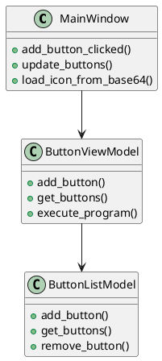

1. Документация и комментарии
Документируйте код: Добавьте комментарии к каждому классу и методу, описывающие их назначение, параметры и возвращаемые значения. Это поможет вам и другим разработчикам быстро понять, что делает тот или иной фрагмент кода.

Используйте docstrings: В Python принято использовать docstrings для описания классов и методов. Например:

```python

class ButtonViewModel(QObject):
    """
    ViewModel для управления кнопками. Связывает Model и View, обрабатывает логику взаимодействия.
    """
    def add_button(self, name: str, path: str):
        """
        Добавляет новую кнопку в модель.
        :param name: Имя кнопки.
        :param path: Путь к программе, которую нужно запустить.
        """
        self._model.add_button(name, path)
        self.buttonsChanged.emit()
```

2. Диаграммы классов
Создайте диаграмму классов: Используйте инструменты, такие как PlantUML или PyCharm, чтобы визуализировать отношения между классами. Это поможет вам увидеть, какие классы взаимодействуют друг с другом и как они связаны.

Пример диаграммы классов:


3. График вызовов методов
Используйте инструменты для анализа вызовов: Например, в PyCharm есть встроенный инструмент для анализа вызовов методов. Вы можете увидеть, какие методы вызывают другие методы и как данные передаются между ними.

Пример графа вызовов:

    MainWindow.add_button_clicked() вызывает ButtonViewModel.add_button().
    ButtonViewModel.add_button() вызывает ButtonListModel.add_button().

4. Логирование
Добавьте логирование: Используйте модуль logging для отслеживания вызовов методов и их результатов. Это поможет вам понять, как работает программа в реальном времени.

Пример логирования:

```python
import logging

logging.basicConfig(level=logging.DEBUG)

class ButtonViewModel(QObject):
    def add_button(self, name: str, path: str):
        logging.debug(f"Добавление кнопки: {name}, {path}")
        self._model.add_button(name, path)
        self.buttonsChanged.emit()
```        
5. Интерактивная документация
Используйте Sphinx: Создайте документацию с помощью Sphinx. Это позволит вам генерировать HTML-документацию с описанием всех классов и методов.

Пример использования Sphinx:

    Установите Sphinx: pip install sphinx.
    Создайте документацию: sphinx-quickstart.
    Добавьте описание классов и методов в .rst файлы.

6. Тестирование
Напишите тесты: Используйте модуль unittest или pytest для написания тестов. Это поможет вам понять, как работают отдельные методы и классы.

Пример теста:

```python

import unittest

class TestButtonViewModel(unittest.TestCase):
    def test_add_button(self):
        model = ButtonListModel()
        view_model = ButtonViewModel(model)
        view_model.add_button("Test", "C:/test.exe")
        self.assertEqual(len(model.get_buttons()), 1)
```        
1. Рефакторинг
Разделяйте код на модули: Если код становится слишком большим, разделите его на несколько модулей. Например, отделите логику работы с базой данных от логики интерфейса.

Используйте принципы SOLID: Следуйте принципам SOLID (Single Responsibility, Open/Closed, Liskov Substitution, Interface Segregation, Dependency Inversion) для создания более понятного и поддерживаемого кода.

8. Инструменты для анализа кода
Используйте статические анализаторы: Инструменты, такие как pylint, flake8, или mypy, помогут вам найти потенциальные проблемы в коде и улучшить его читаемость.

Пример использования pylint:

```bash
    pylint your_module.py
```
9. Интерактивные среды разработки
Используйте IDE: Современные IDE, такие как PyCharm, VSCode или PyDev, предоставляют множество инструментов для навигации по коду, поиска определений методов, анализа вызовов и т.д.

10. Создание карты кода
Создайте карту кода: Это может быть текстовый файл или диаграмма, где вы опишете, какие классы и методы за что отвечают, и как они взаимодействуют друг с другом.

Пример карты кода:

MainWindow (View)
  - add_button_clicked() -> вызывает ButtonViewModel.add_button()
  - update_buttons() -> обновляет кнопки на основе данных из ButtonViewModel

ButtonViewModel (ViewModel)
  - add_button() -> вызывает ButtonListModel.add_button()
  - get_buttons() -> возвращает список кнопок из ButtonListModel

ButtonListModel (Model)
  - add_button() -> добавляет кнопку в список
  - get_buttons() -> возвращает список кнопок
Заключение
Используя эти инструменты и подходы, вы сможете легко ориентироваться в коде, понимать, как работают отдельные компоненты, и быстро находить нужные фрагменты кода. Это особенно полезно при работе с большими проектами, где важно поддерживать порядок и читаемость кода.